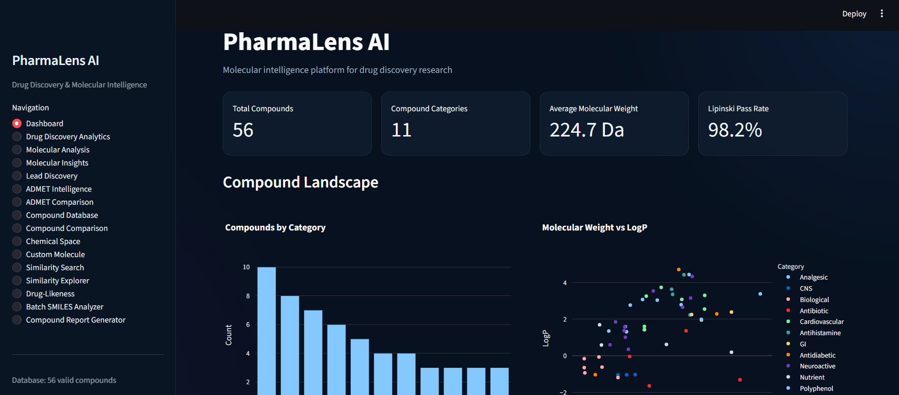
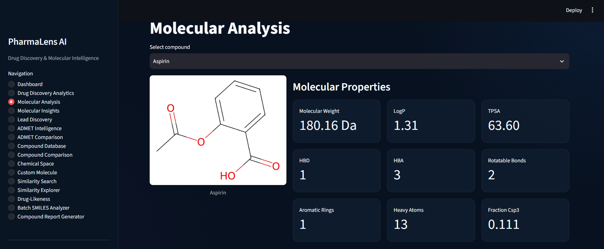
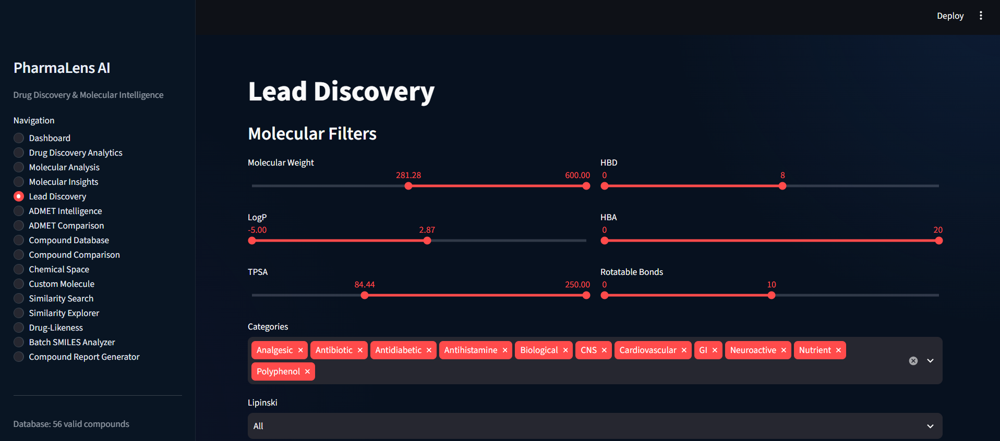
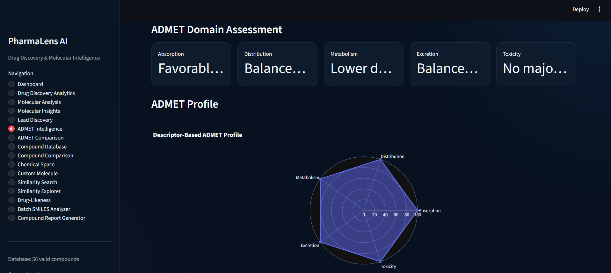
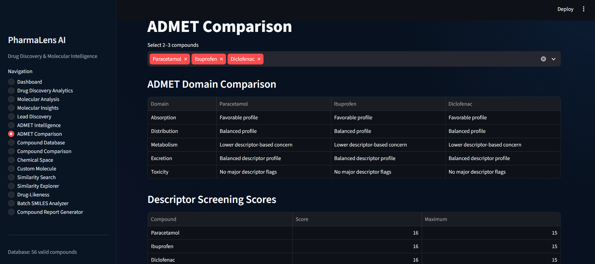
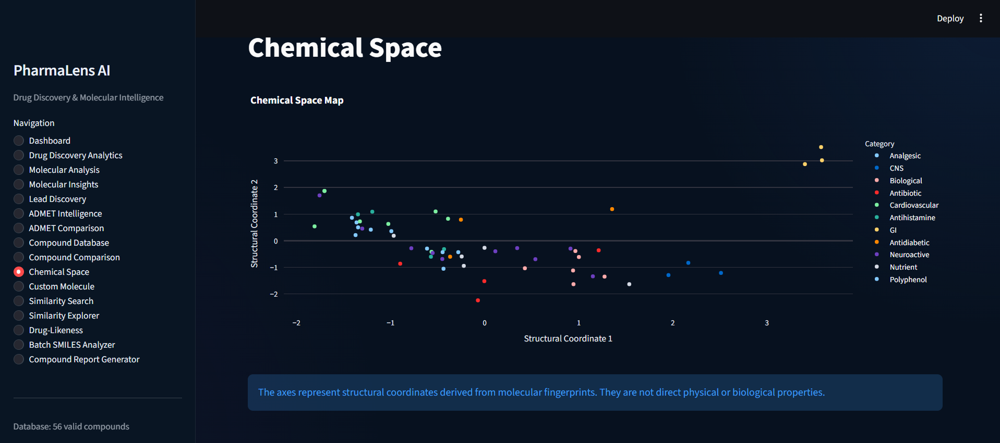
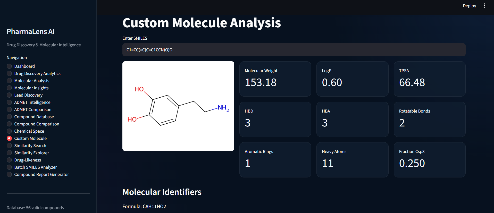
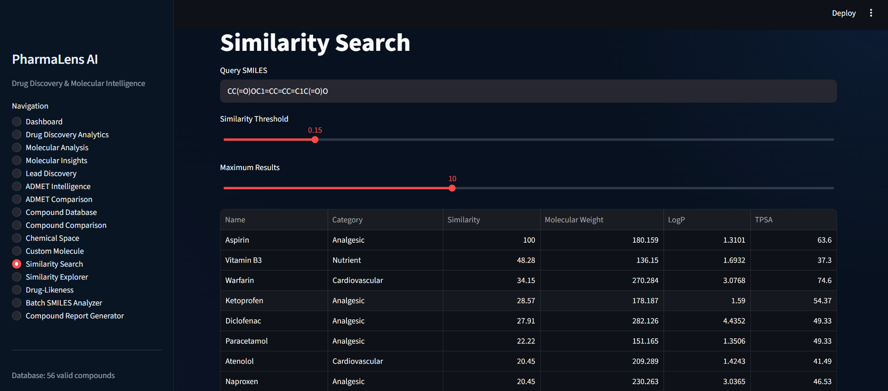
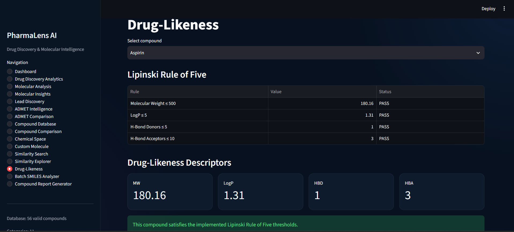
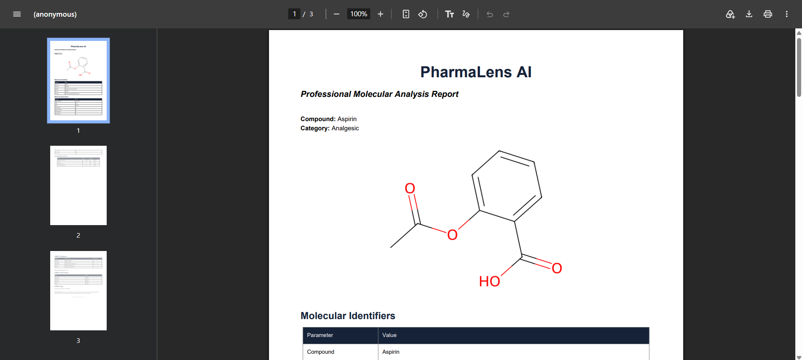

# PharmaLens AI

An interactive AI-assisted chemoinformatics and drug discovery platform built with Python, RDKit, Pandas, NumPy, Plotly, and Streamlit.

PharmaLens AI is designed to demonstrate how computational chemistry and molecular descriptors can support early-stage drug discovery workflows through molecular analysis, similarity searching, lead filtering, ADMET screening, chemical-space exploration, and automated reporting.

---

# Application Preview

PharmaLens AI provides an interactive interface for molecular analysis, drug discovery, ADMET screening, chemical-space exploration, and computational reporting.

## Dashboard



## Molecular Analysis



## Lead Discovery



## ADMET Intelligence



## ADMET Comparison



## Chemical Space



## Custom Molecule Analysis



## Similarity Search



## Drug-Likeness



## Professional Reports



---

# Overview

PharmaLens AI is a portfolio-oriented computational drug discovery application that combines cheminformatics, molecular descriptors, similarity analysis, rule-based ADMET screening, and interactive data visualization into a single Streamlit platform.

The application allows users to investigate chemical structures and compare compounds using commonly used molecular properties and computational screening techniques.

---

# Key Features

## Molecular Analysis

Analyze individual compounds using SMILES input and calculate:

- Molecular Weight
- LogP
- TPSA
- Hydrogen Bond Donors
- Hydrogen Bond Acceptors
- Rotatable Bonds
- Aromatic Rings
- Heavy Atoms
- Fraction Csp3
- Molecular Formula
- InChI Key

---

## Lipinski Drug-Likeness

Evaluate compounds using Lipinski's Rule of Five:

- Molecular Weight
- LogP
- Hydrogen Bond Donors
- Hydrogen Bond Acceptors
- Rule-of-Five violations
- Overall Lipinski status

---

## Molecular Similarity Search

Perform Morgan fingerprint-based similarity searching using:

- Morgan fingerprints
- Radius = 2
- 2048 fingerprint bits
- Tanimoto similarity

The application compares a query molecule against compounds in the PharmaLens database.

---

## Chemical Space Exploration

Explore the structural relationships between compounds using molecular fingerprints and dimensionality reduction.

The interactive visualization allows users to:

- Explore compound clusters
- Identify structurally related molecules
- Hover over compounds for additional information
- Zoom and pan through chemical space

---

## Lead Discovery

Filter compounds using molecular-property constraints such as:

- Molecular Weight
- LogP
- TPSA
- HBD
- HBA
- Rotatable Bonds
- Compound category
- Lipinski status

This provides a simple computational workflow for prioritizing compounds for further investigation.

---

## ADMET Intelligence

PharmaLens AI provides descriptor-based ADMET screening across:

- Absorption
- Distribution
- Metabolism
- Excretion
- Toxicity

The system provides:

- Domain-level screening status
- Descriptor flags
- ADMET profile visualization
- Overall descriptor screening score

> ADMET outputs are computational screening indicators based on molecular descriptors. They are not experimental measurements, clinical predictions, or validated pharmacokinetic/toxicity models.

---

## ADMET Comparison

Compare multiple compounds side-by-side using:

- ADMET domain statuses
- Descriptor screening scores
- Molecular descriptors
- ADMET profile visualization
- Molecular structures
- Descriptor flags

---

## Batch SMILES Analyzer

Analyze multiple molecules simultaneously by providing one SMILES string per line.

The analyzer generates:

- Molecular descriptors
- Lipinski status
- Molecular formulas
- Compound statistics
- Valid/invalid SMILES counts
- CSV export

---

## Compound Report Generator

Generate computational compound reports containing:

- Molecular structure
- SMILES
- Molecular Formula
- InChI Key
- Molecular descriptors
- Lipinski analysis
- ADMET screening
- Descriptor flags
- ADMET profile
- Scientific disclaimer

Reports can be exported as text and professional PDF documents.

---

## Drug Discovery Analytics

Interactive analytics dashboard containing:

- Molecular Weight distributions
- LogP distributions
- TPSA distributions
- Fraction Csp3 distributions
- Property relationship plots
- Category analytics
- Compound rankings
- Lipinski distribution
- Correlation analysis
- Filtered dataset export

---

# Scientific Methodology

PharmaLens AI uses established cheminformatics approaches for molecular representation and descriptor calculation.

### Molecular Descriptors

RDKit is used to calculate molecular properties including:

- Molecular Weight
- LogP
- TPSA
- Hydrogen Bond Donors
- Hydrogen Bond Acceptors
- Rotatable Bonds
- Aromatic Rings
- Heavy Atoms
- Fraction Csp3

### Molecular Fingerprints

Molecules are represented using Morgan fingerprints generated with:

- Radius: 2
- Fingerprint size: 2048 bits

### Molecular Similarity

Tanimoto similarity is used to compare molecular fingerprints.

### Drug-Likeness

Lipinski's Rule of Five is used as a basic computational drug-likeness screening framework.

### ADMET Screening

ADMET Intelligence uses descriptor-based heuristic rules to flag potentially relevant molecular-property patterns.

These outputs are intended for educational and early-stage computational screening rather than experimental validation.

---

# Technology Stack

| Technology | Purpose |
|---|---|
| Python | Core programming |
| Streamlit | Interactive web application |
| RDKit | Cheminformatics and molecular analysis |
| Pandas | Data processing |
| NumPy | Numerical computation |
| Plotly | Interactive visualization |
| ReportLab | PDF report generation |
| Pytest | Automated testing |
| Git | Version control |
| GitHub | Project hosting |

---

# Project Structure

```text
pharmalens-ai/
│
├── app.py
├── create_database.py
├── main.py
├── README.md
├── requirements.txt
├── test_rdkit.py
│
├── data/
│   ├── compounds.csv
│   └── drugs.json
│
├── models/
│
├── notebooks/
│
├── reports/
│   ├── aspirin_structure.png
│   ├── caffeine_structure.png
│   └── screenshots/
│       ├── dashboard.png
│       ├── drug.png
│       ├── molecular.png
│       ├── lead.png
│       ├── admet.png
│       ├── admet2.png
│       ├── chemical.png
│       ├── custom.png
│       ├── similarity.png
│       ├── druglikeness.png
│       └── report.png
│
├── src/
│   └── project modules
│
└── tests/
    └── test_pharmalens.py